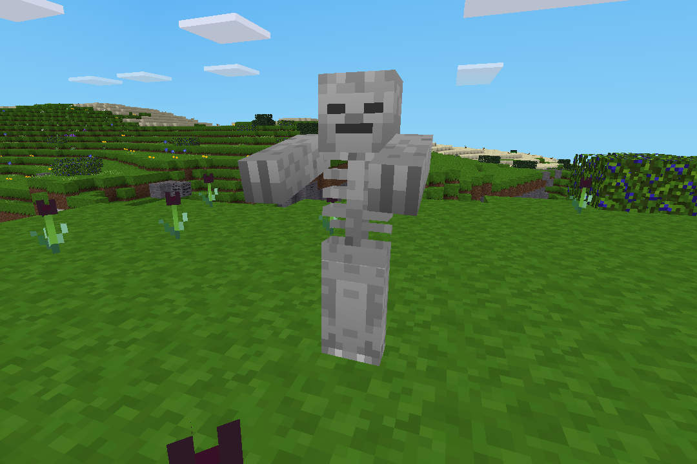

## Skeleton for Minetest

### Description:

A skeleton mob using the [cmer (Creatures Revived)](https://forum.minetest.net/viewtopic.php?t=26684) or [mobs_redo](https://content.minetest.net/packages/TenPlus1/mobs/) API.



### Licensing:

- Code: [MIT](LICENSE.txt)
- Textures:
	- [skeleton_mesh](https://github.com/MultiCraft/MultiCraft_game/blob/df93498/files/mobs/mobs_monster/textures/mobs_skeleton.png): (C) 2016 MultiCraft Development Team (CC BY-SA 4.0)
	- [skeleton_bone](https://opengameart.org/node/3755): by bart (CC0)
- Models:
	- [creatures_zombie.b3d](https://github.com/BlockMen/cme): by BlockMen (CC-BY-SA 3.0)

### Requirements:

```
Minetest min version: 5.0

Depends: none

Optional depends:
  - mobs
  - cmer
  - creatures
  - asm_spawneggs
  - sounds
```

***NOTE:** `mobs` & `cmer` are listed as optional depends so that either can be used. But it is required that at least one is installed. `mobs` will take precedence over `cmer`.*

### Links:

- [](https://content.minetest.net/packages/AntumDeluge/skeleton/)
- [Forum](https://forum.minetest.net/viewtopic.php?t=27168)
- [Git repo](https://github.com/AntumMT/mod-skeleton)
- [Changelog](changelog.txt)
- [TODO](TODO.txt)
